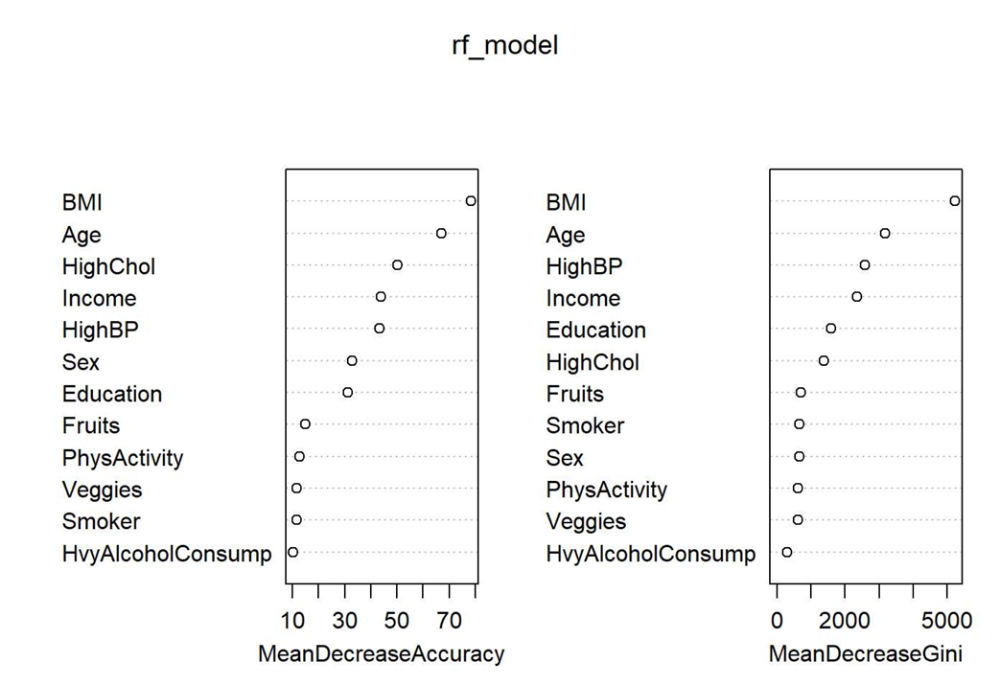
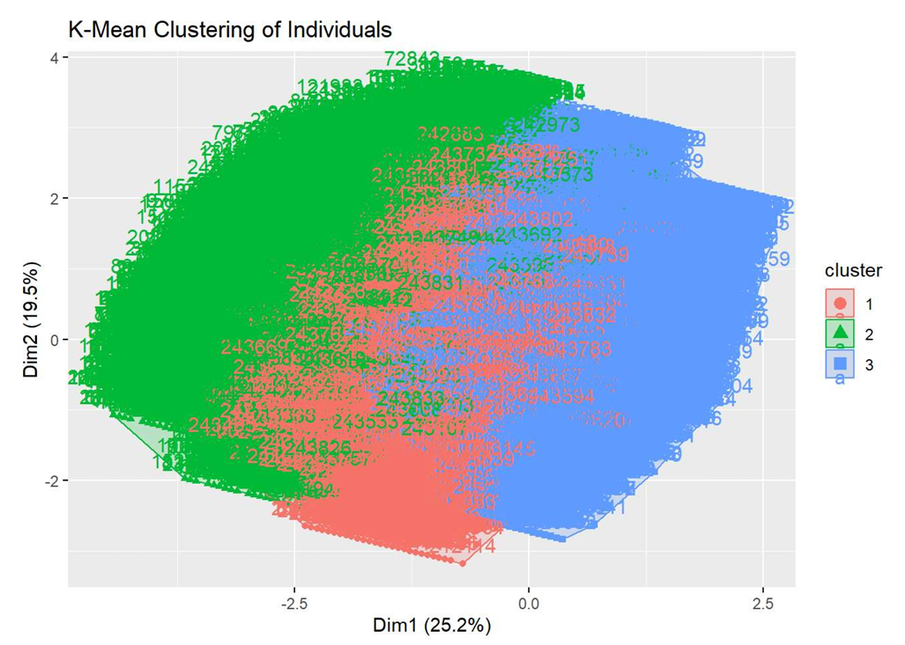
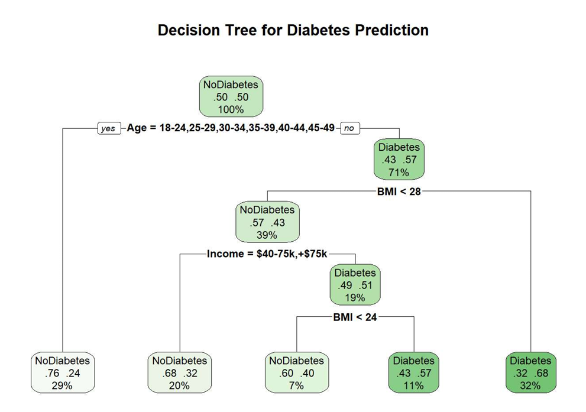

# 🧠 Diabetes Risk Modelling using Statistical and Machine Learning Techniques

---

## 📌 Project Overview

This project presents a comprehensive analysis of diabetes risk using statistical modelling and machine learning techniques in R. It investigates how biological, behavioural, and socioeconomic factors influence the likelihood of diabetes and aims to build robust predictive models.

The workflow follows an end-to-end data science pipeline, including data preprocessing, exploratory data analysis (EDA), feature engineering, predictive modelling, and performance evaluation. Special attention is given to real-world challenges such as class imbalance and model bias.

---

## 🎯 Objectives

* Analyse patterns and trends in diabetes-related health data
* Identify key biological and lifestyle predictors of diabetes
* Examine the impact of lifestyle factors after controlling for age and BMI
* Develop and compare multiple predictive models
* Evaluate model performance using appropriate metrics
* Interpret findings for real-world healthcare insights

---

## ❓ Research Questions

1. Which biological (Age, BMI) and lifestyle factors (smoking, alcohol consumption, diet) significantly influence diabetes risk?

2. Do lifestyle behaviours remain significant predictors after controlling for biological factors?

3. How do health status and socioeconomic factors relate to diabetes prevalence?

---

## 📊 Dataset Information

The dataset consists of health survey data containing demographic, lifestyle, and medical attributes.

### 🎯 Target Variable

**Diabetes_012**

* 0 → No Diabetes
* 1 → Prediabetes
* 2 → Diabetes

### 🔍 Key Features

* Demographic: Age, Income, Education
* Biological: BMI
* Lifestyle: Smoking, Alcohol Consumption, Diet (Fruits, Vegetables), Physical Activity
* Health Indicators: General Health, Mental Health, Physical Health

---

## 🗂 Project Structure

```text
diabetes-risk-modelling/
│── data/
│   ├── raw_data.csv
│   ├── cleaned_data.csv
│
│── scripts/
│   ├── eda_preprocessing.R
│   ├── modelling.R
│   ├── clustering_analysis.R
│
│── outputs/
│   ├── plots/
│   ├── model_results
│
│── report/
│   ├── final_report.Rmd
│   ├── final_report.pdf
│
│── README.md
```

---

## ⚙️ Methodology

### 🔹 Data Preprocessing & EDA

* Handling missing values and inconsistencies
* Outlier detection and treatment
* Feature transformation and encoding
* Exploratory visualisations and correlation analysis

### 🔹 Predictive Modelling

* Logistic Regression (Binary & Multinomial)
* Random Forest
* Model comparison (before & after data cleaning)

### 🔹 Clustering Analysis

* K-Means clustering to identify population segments
* Cluster interpretation and comparison with diabetes prevalence

---

## 📈 Model Evaluation

Models were evaluated using:

* Accuracy
* Confusion Matrix
* Sensitivity (Recall)
* Specificity
* Kappa Statistic

⚠️ **Important Insight:**
Despite high accuracy (~86–87%), models showed poor performance in detecting diabetes cases due to class imbalance, highlighting limitations of accuracy as a sole metric.

## 📊 Model Performance



BMI is the most significant predictor of diabetes, followed by age, high cholesterol, and income, according to the random forest model's variable importance plot. While lifestyle factors like fruit and vegetable consumption, physical activity, and smoking have a smaller but noticeable impact, blood pressure and education also make a moderate contribution to the model. The least significant factor seems to be heavy drinking. Overall, the findings show that clinical and biological factors are more important in predicting diabetes than lifestyle factors.

---

## 📉 Clustering Results



The K-means clustering results indicate that individuals are categorized into three distinct clusters according to their characteristics. There is some overlap between clusters, but there are clear patterns that show differences in profiles like age, BMI, and lifestyle factors. These clusters help find groups of people who have similar risk patterns. These groups can then be studied more closely to see how they are related to diabetes outcomes

---

## 🌳 Random Forest Tree



The decision tree says that age and BMI are the two most important things to look at when trying to figure out if someone has diabetes. People who are older and have a higher BMI are more likely to have diabetes. Income is another factor, with people who make less money being more likely to get sick. The tree shows how biological and socioeconomic factors work together to affect diabetes outcomes.

---

## 🔍 Key Findings

* BMI and Age are the strongest predictors of diabetes
* Diabetes risk increases significantly with age
* Higher income is associated with lower diabetes risk
* Vegetable consumption shows a protective effect
* Lifestyle factors alone are weaker predictors but become relevant when combined with demographic variables
* Models are biased toward the majority class, failing to effectively detect minority (diabetes) cases

---

## ⚠️ Challenges Identified

* Severe class imbalance in dataset
* Misleading high accuracy
* Low specificity in detecting diabetes
* Model bias toward majority class

---

## 🚀 Future Improvements

* Apply resampling techniques (SMOTE, Oversampling)
* Use advanced models (XGBoost, Gradient Boosting)
* Hyperparameter tuning and cross-validation
* Feature importance and interpretability analysis
* ROC-AUC and F1-score based evaluation
* Deployment as a predictive healthcare tool

---

## 🛠 Tools & Technologies

**Programming:**

* R

**Libraries:**

* tidyverse
* ggplot2
* dplyr
* caret
* nnet

**Techniques:**

* Exploratory Data Analysis
* Statistical Modelling
* Machine Learning
* Clustering (K-Means)
* Feature Engineering

---

## 🌍 Ethical Considerations

This project considers ethical implications of analysing health data, including fairness, bias, and socioeconomic disparities. Results are interpreted with awareness of potential inequalities in healthcare access and outcomes.

---

## 📌 Conclusion

The study demonstrates that while machine learning models can effectively identify general patterns in diabetes risk, they require careful handling of class imbalance to be practically useful. The findings highlight the importance of combining statistical insight with robust modelling techniques for real-world healthcare applications.

---

## 👤 Author

Santosh

MSc Data Science

University Project – Modelling Data

---

## ⭐ Acknowledgment

If you found this project useful, feel free to ⭐ the repository!
